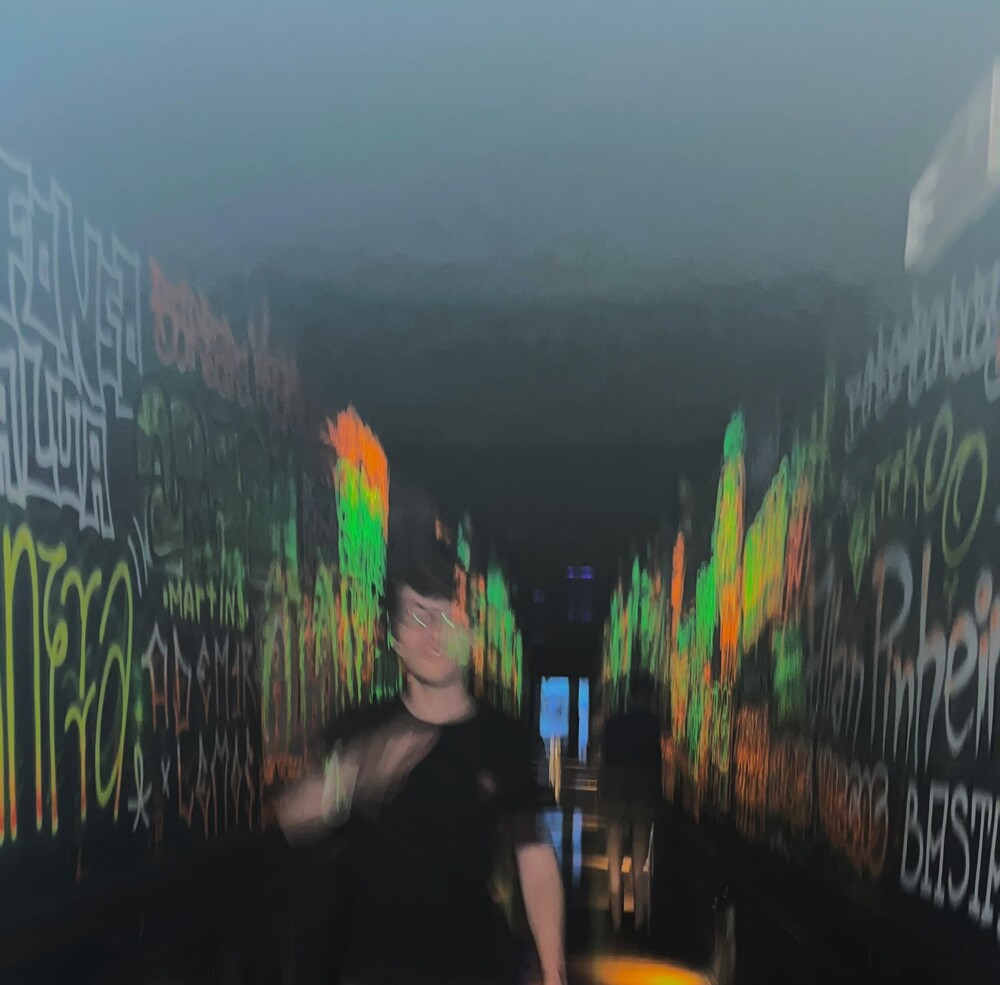
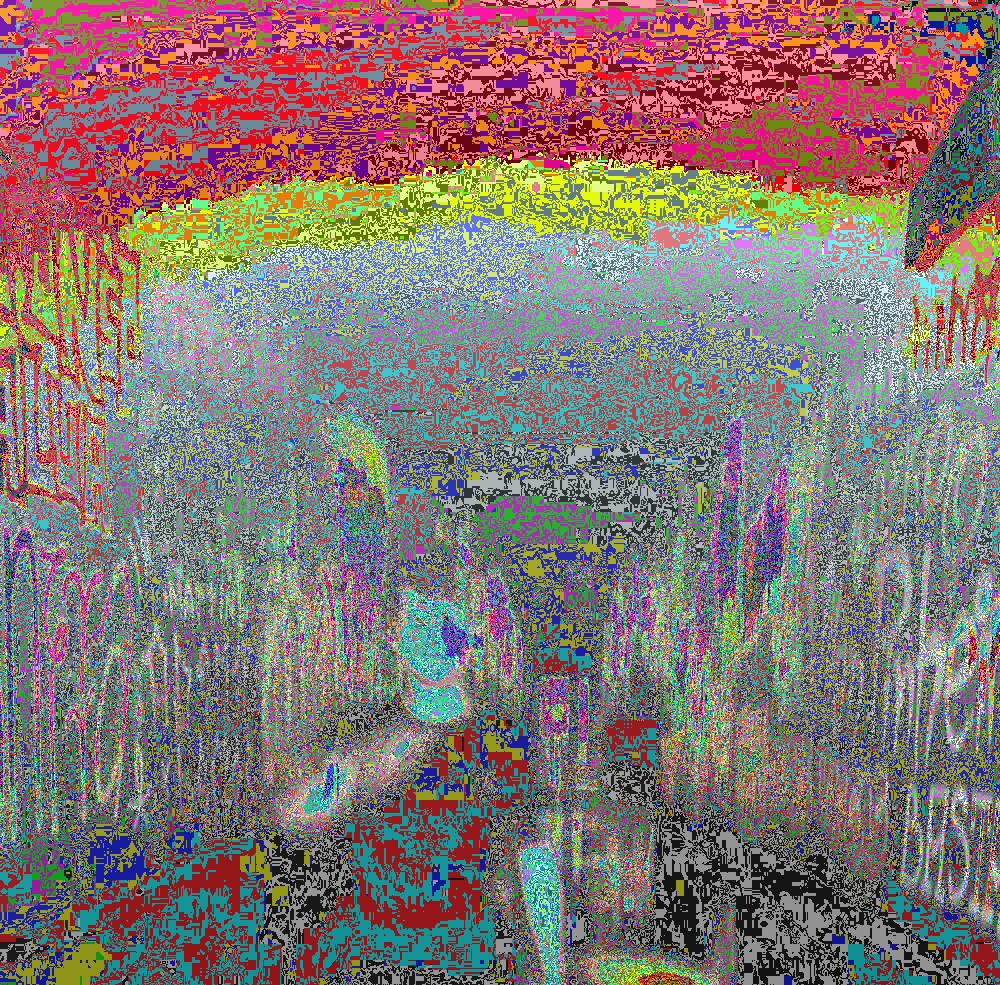
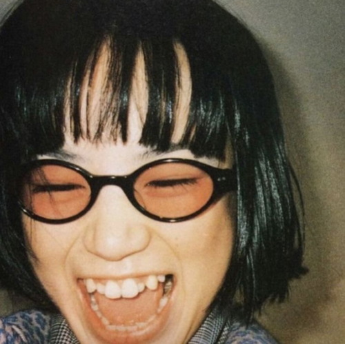
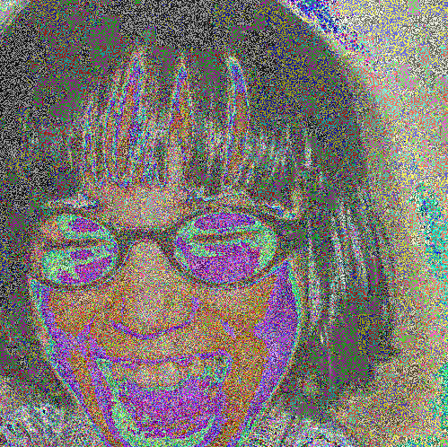
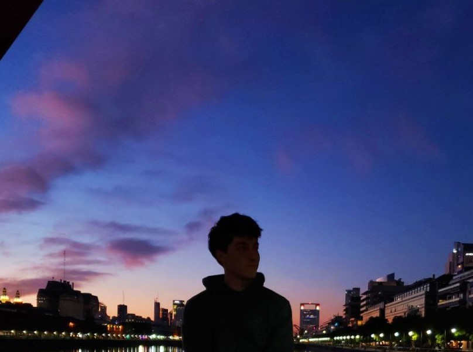
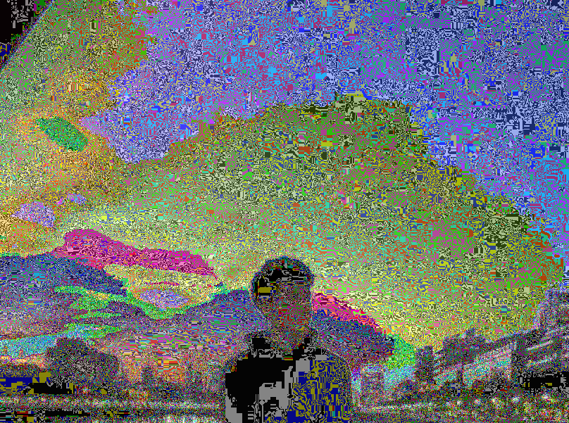
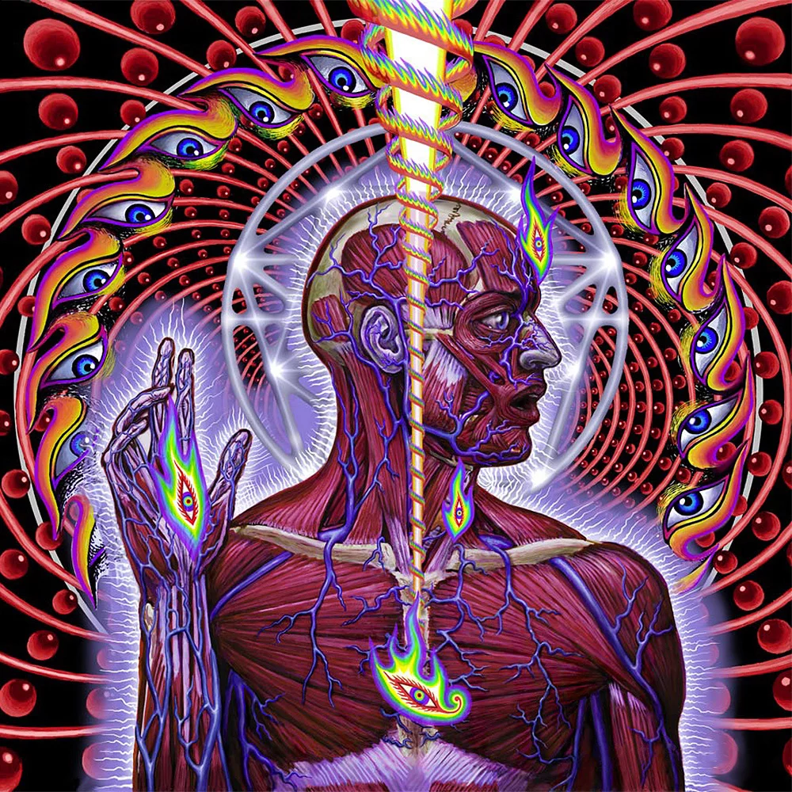
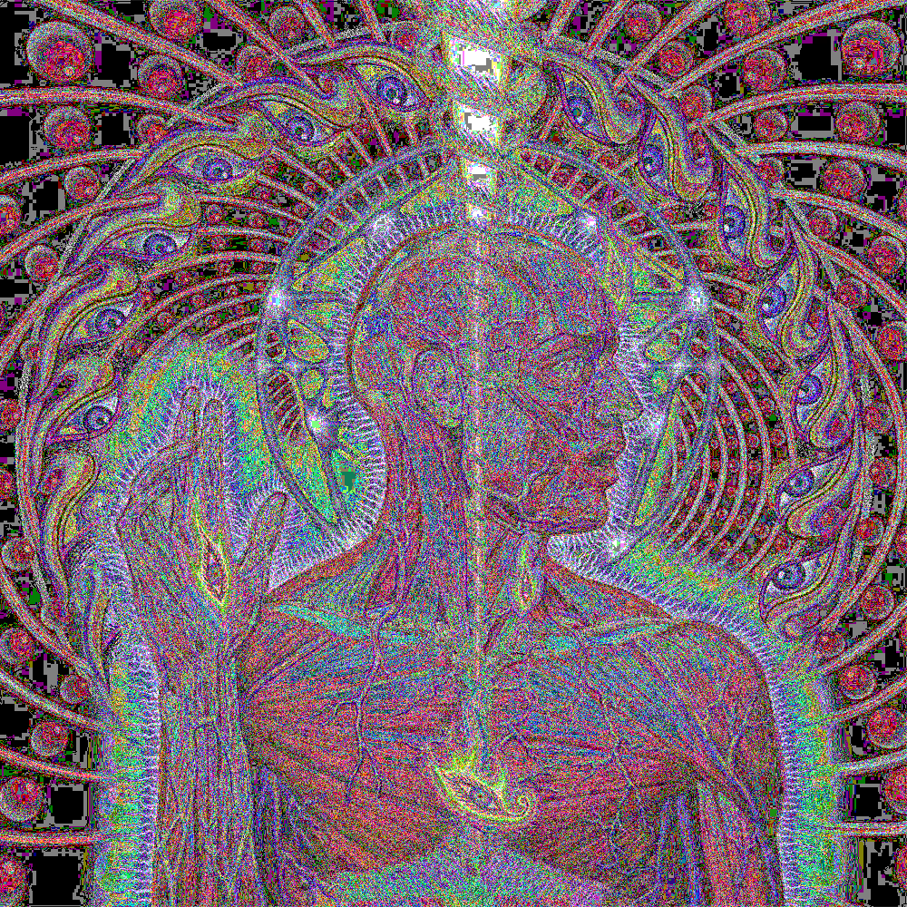

De entre todo el codigo basura de mi compu, algo destaca por su factor artistico. 

Éste algoritmo en particular, que le puse de nombre _bit swap_, es muy boludo pero queda lindo; 

La idea es tomar una imagen RGB y cambiar de lugar el bit mas significativo con el menos significativo en cada canal para cada pixel.

Por ejemplo, si un pixel tiene el valor (255, 1, 1), entonces como 255 en binario es 11111111, cambiando el LSB (Least significant bit) por el MSB (Most significant bit) queda igual. Por otro lado 1 en binario es 00000001, y cambiando el LSB con el MSB queda 10000000 que es 128. Entonces el pixel final termina siendo (255, 128, 128).

:-------------------------:|:-------------------------:
 | 
 | 
 | 
 | 

El LSB termina siendo el MSB, y determinando así el cambio en el pixel. Mientras que el valor que tenga el MSB no importa, ya que pasa a ser el LSB y los cambios ni se ven.

## Bit Reversion

Los mayores cambios en la imagen se van a dar cuando el MSB y el LSB sean distintos, osea que el impacto del algoritmo depende de la imagen en si.
Por eso, para escaparnos un poco de esa restricción, lo que hice fue crear otro algoritmo, que le dá al MSB cierta probabilidad de invertirse.
Recorro cada pixel, y en cada canal cambio el MSB con una probabilidad p. Lo hice para 100 p's distintos, y el cambio a medida que aumenta la probabilidad se ve asi (esperar que cargue el gif):

Los resultados pueden ser parecidos, pero no iguales a los de bit swap, ya que este algoritmo simula ruido con cierta probabilidad, osea, cambia el bit en pixeles random, mientras que el bit swap puede encontrar regiones en las que todos los LSB son iguales, lo que termina generando regiones mas notables, que resaltan mas que si usaramos este ultimo algoritmo.

Para ver cuanta randomness tendrá una imagen al aplicar bit swap, se puede calcular la entropía de Shannon sobre cada bit plane de cada canal de la imagen. 

----

Se puede usar para generar un efecto de ruido sobre imagenes. Fijamos p, y cada frame del video es una corrida del algoritmo que recorre y cambia el pixel con probabilida p sobre la imagen original:

p=0.2|p=0.5|p=0.9
:-------------------------:|:-------------------------:|:-------------------------:
 |  | 

Si p=1 no habria efecto de ruido, porque siempre cambia el MSB.
